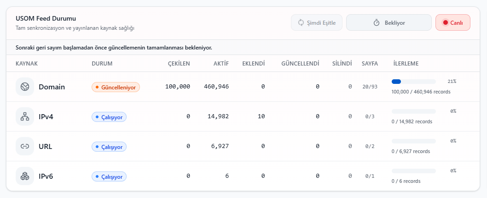

<div align="center">

# USOM IOC Gateway

**USOM IOC verilerini senkronize eden ve güvenlik ürünleri için kullanıma hazır TXT feed'leri yayımlayan Docker tabanlı IOC Gateway.**

<p>
  
  
  
</p>

<p>
  <a href="./README.md">
    
  </a>
  <a href="./README_EN.md">
    
  </a>
</p>

</div>

<p align="center">
  
</p>

## Nedir?

USOM tarafından yayımlanan domain, IPv4, IPv6 ve URL IOC kayıtlarını düzenli olarak senkronize eder. Verileri web paneli üzerinden yönetir ve firewall, SIEM veya güvenlik ağ geçitlerinin kullanabileceği TXT feed'leri halinde sunar.

## Özellikler

- Domain, IPv4, IPv6 ve URL senkronizasyonu
- Ayrı worker servisleriyle paralel işleme
- Web tabanlı yönetim ve durum takibi
- TXT feed üretimi ve yayını
- PostgreSQL üzerinde kalıcı veri saklama
- Ubuntu ve Windows için otomatik kurulum

## Kurulum

### Ubuntu

Temiz bir Ubuntu sunucuda çalıştırın:

```bash
curl -fsSL https://raw.githubusercontent.com/hguler07/usom-ioc-gateway/main/bootstrap-ubuntu.sh -o bootstrap-ubuntu.sh
chmod +x bootstrap-ubuntu.sh
sudo ./bootstrap-ubuntu.sh
```

### Windows 10 / 11

PowerShell'i **Yönetici olarak** açın ve çalıştırın:

```powershell
irm "https://raw.githubusercontent.com/hguler07/usom-ioc-gateway/main/install-windows.ps1?v=$([DateTimeOffset]::UtcNow.ToUnixTimeSeconds())" | iex
```

Kurulum araçları gerekli bileşenleri kontrol eder. Admin parolası otomatik oluşturulur ve kurulum sonunda gösterilir.

## Erişim

| Ortam | Yönetim paneli | Feed dizini |
|---|---|---|
| Ubuntu | `http://SUNUCU_IP_ADRESI` | `http://SUNUCU_IP_ADRESI/feeds/` |
| Windows | `http://localhost:8080` | `http://localhost:8080/feeds/` |

Varsayılan kullanıcı adı: `admin`

## Sistem Gereksinimleri

| CPU | RAM | Disk |
|---:|---:|---:|
| 2 vCPU | 4 GB | 40 GB |

## Temel Komutlar

Proje dizinine geçin:

```bash
cd /opt/usom-ioc-gateway
```

Windows:

```powershell
Set-Location "C:\USOM\usom-ioc-gateway"
```

Servis durumunu görüntüleyin:

```bash
docker compose ps
```

Canlı logları izleyin:

```bash
docker compose logs -f
```

İmajları güncelleyip servisleri yeniden başlatın:

```bash
docker compose pull
docker compose up -d --remove-orphans
```

> `.env` dosyası parola ve secret bilgileri içerir. GitHub'a yüklenmemelidir.
