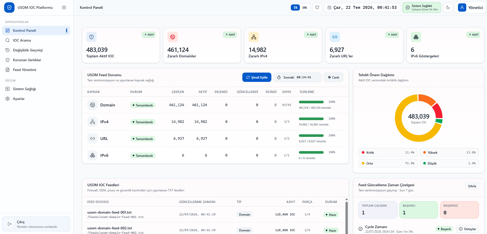

<div align="center">

# USOM IOC Platformu

**USOM IOC verilerini senkronize eden ve güvenlik ürünleri için kullanıma hazır TXT feed'leri yayımlayan Docker tabanlı IOC Platformu.**

<p>
  
  
  
  
</p>

<p>
  <a href="./README.md"><strong>Türkçe</strong></a>
  &nbsp;&nbsp;•&nbsp;&nbsp;
  <a href="./README_EN.md">English</a>
</p>

</div>

<p align="center">
  
</p>

<p align="center">
  <sub>Web yönetim paneli ve servis durumu görünümü</sub>
</p>

<h2 align="center">USOM IOC Gateway Nedir?</h2>

<p align="center">
USOM tarafından yayımlanan tehdit göstergelerini düzenli olarak senkronize eder,
merkezi bir web paneli üzerinden yönetir ve firewall, SIEM veya güvenlik ağ geçitlerinin
kullanabileceği TXT feed'leri halinde sunar.
</p>

<h2 align="center">Öne Çıkan Özellikler</h2>

<p align="center">
- USOM API üzerinden Domain, IPv4, IPv6, IPv6 Network ve URL IOC kayıtlarını senkronize eder.<br>
- Her IOC türünü ayrı worker servisleriyle paralel ve kontrollü şekilde işler.<br>
- IOC arama, sistem sağlığı, senkronizasyon durumu ve değişiklik geçmişini tek panelde gösterir.<br>
- Korunan Varlıklar özelliğiyle kuruma ait domain ve IP adreslerinin IOC listelerinde yer alıp almadığını takip eder.<br>
- Güvenlik ürünlerinin doğrudan kullanabileceği sade TXT feed dosyaları üretir.<br>
- Büyük feed listelerini yönetilebilir parçalara böler.<br>
- Verileri PostgreSQL üzerinde kalıcı olarak saklar.<br>
- Eklenen, silinen, güncellenen ve yeniden eklenen IOC kayıtlarını takip eder.<br>
- Senkronizasyon hatalarına karşı retry, backoff, boş sayfa kontrolü ve tutarlılık kontrolü gibi koruma parametreleri içerir.<br>
- Container image güvenliği için güncel base image kullanımı ve Docker Hub tarafından tespit edilen zafiyetlere yönelik iyileştirmeler yapılmıştır.<br>
- Docker Compose ile Linux ve Windows ortamlarında hızlı kurulum sağlar.<br>
- Türkçe ve İngilizce arayüz desteği sunar.<br>
- Açık ve koyu tema desteğiyle farklı kullanım tercihlerine uyum sağlar.
</p>

<h2 align="center">Kurulum</h2>

### Linux

Uygulama, Docker ve Docker Compose destekleyen güncel Linux dağıtımlarında çalıştırılabilir. Otomatik kurulum için **Ubuntu Server 22.04 veya 24.04 LTS Minimal** önerilir.

```bash
curl -fsSL https://raw.githubusercontent.com/hguler07/usom-ioc-gateway/main/bootstrap-ubuntu.sh -o bootstrap-ubuntu.sh
chmod +x bootstrap-ubuntu.sh
sudo ./bootstrap-ubuntu.sh
```

### Windows 10 / 11

Kurulumdan önce **Docker Desktop'ın kurulu ve çalışır durumda** olduğundan emin olun. Ardından PowerShell'i **Yönetici olarak** açın ve aşağıdaki komutu çalıştırın:

```powershell
irm "https://raw.githubusercontent.com/hguler07/usom-ioc-gateway/main/install-windows.ps1?v=$([DateTimeOffset]::UtcNow.ToUnixTimeSeconds())" | iex
```

Kurulum aracı gerekli bileşenleri kontrol eder. Yönetici parolası otomatik oluşturulur ve işlem sonunda ekranda gösterilir.

<h2 align="center">Erişim</h2>

<table align="center">
  <thead>
    <tr>
      <th align="center">Ortam</th>
      <th align="center">Yönetim Paneli</th>
      <th align="center">Feed Dizini</th>
    </tr>
  </thead>
  <tbody>
    <tr>
      <td align="center"><strong>Linux</strong></td>
      <td align="center"><code>http://SUNUCU_IP_ADRESI</code></td>
      <td align="center"><code>http://SUNUCU_IP_ADRESI/feeds/</code></td>
    </tr>
    <tr>
      <td align="center"><strong>Windows</strong></td>
      <td align="center"><code>http://localhost:8080</code></td>
      <td align="center"><code>http://localhost:8080/feeds/</code></td>
    </tr>
  </tbody>
</table>

<p align="center">
  **Not:** Varsayılan yönetici kullanıcısı <code>admin</code> olarak oluşturulur. Yönetici şifresi kurulum sırasında otomatik üretilir ve kurulum tamamlandığında terminal ekranında görüntülenir.
</p>

<h2 align="center">Minimum Sistem Gereksinimleri</h2>

<p align="center">
  
  
  
</p>

<p align="center">
  <sub>
    Hüseyin Güler tarafından geliştirilmiştir · © 2026<br>
    Kurumların kendi altyapılarında çalıştırabilmesi için hazırlanmış ve kullanıma sunulmuştur.
  </sub>
</p>
